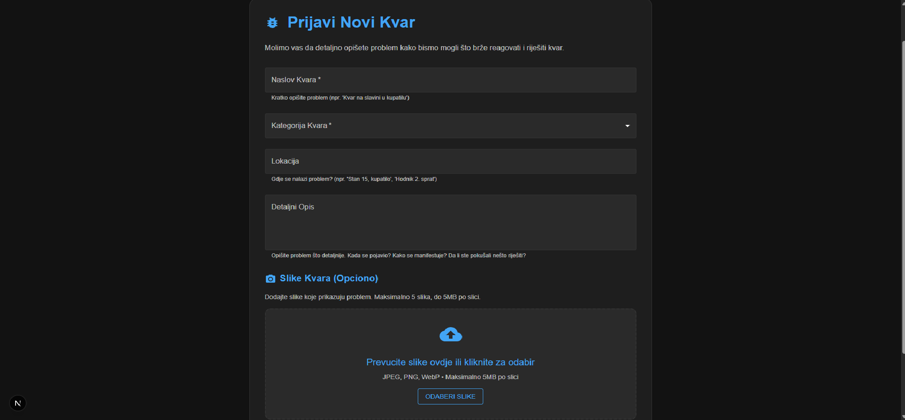
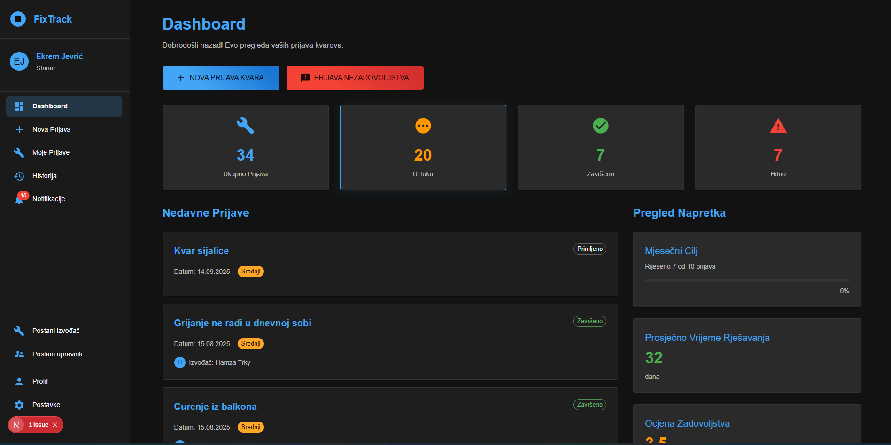
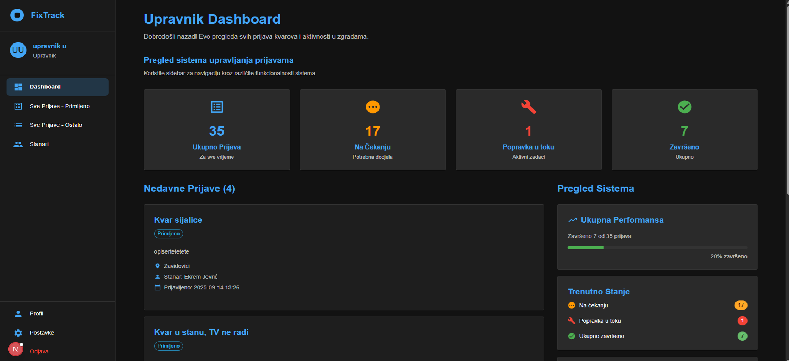
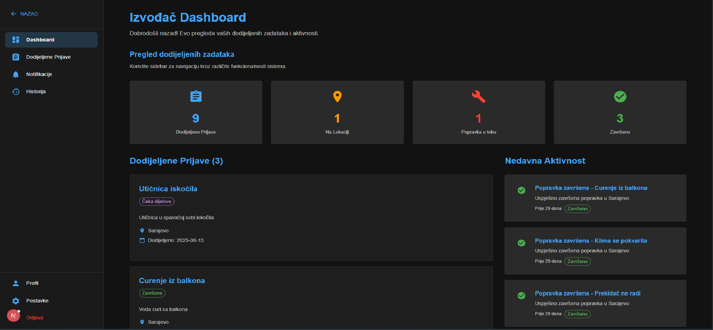
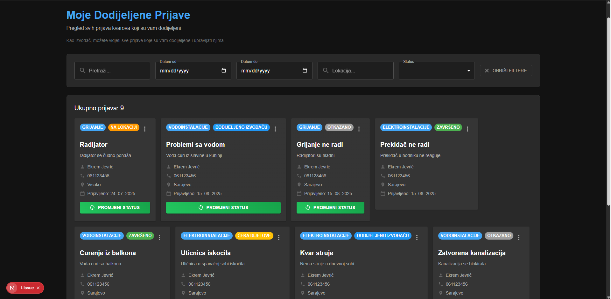
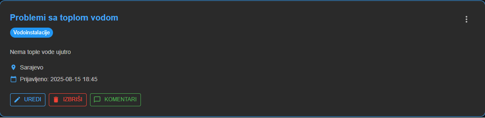
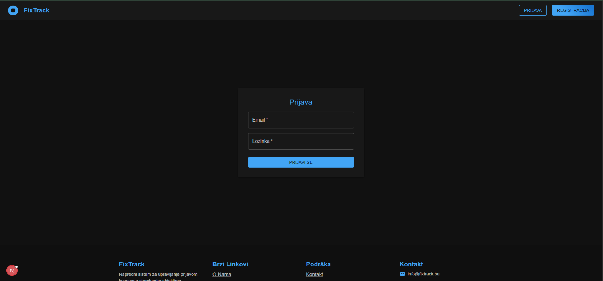

# FixTrack - Sistem za upravljanje prijavom kvarova u stambenim objektima

## 1. Uvod i pregled projekta

**FixTrack** je web aplikacija dizajnirana za efikasno upravljanje prijavama tehničkih kvarova u stambenim objektima. Sistem omogućava stanarima da jednostavno prijave kvarove, upravnicima da raspoređuju zadatke izvođačima, a izvođačima da prate i rješavaju dodijeljene kvarove.

### Cilj projekta
Glavni cilj je stvaranje centralizovanog sistema koji će pojednostaviti proces prijave i rješavanja kvarova, poboljšati komunikaciju između svih uključenih strana i omogućiti praćenje statusa svih prijava u realnom vremenu.

### Tehnologije
- **Frontend**: React + Next.js
- **Backend**: FastAPI (Python)
- **Baza podataka**: PostgreSQL

## 2. Uloge korisnika

### Stanar
- Prijavljuje kvarove sa detaljnim opisom i slikama
- Prati status svojih prijava
- Komunicira sa upravnikom i izvođačem kroz komentare
- Ocjenjuje kvalitet usluge nakon završetka radova
- Pregleda historiju svojih prijava

### Upravnik
- Pregleda sve prijave u sistemu
- Dodjeljuje izvođače na prijave
- Mijenja status prijava
- Komunicira sa stanarima i izvođačima
- Dodaje napomene za stanove i stanare

### Izvođač
- Pregleda dodijeljene prijave
- Označava status radova (u toku, završeno)
- Uploaduje slike i dokumentaciju
- Komunicira sa stanarima i upravnikom
- Pregleda historiju završenih kvarova

### Administrator
- Upravlja korisnicima
- Odobrava ili odbija prijave za promjenu uloga

## 3. Glavne funkcionalnosti

### Prijava kvarova
Stanari mogu prijaviti kvar sa sljedećim informacijama:
- Naslov i detaljan opis problema
- Kategorija kvara
- Lokacija (adresa stana)
- Priložene slike
- Prioritet



### Dashboard za stanare
Stanari imaju pristup dashboard-u gdje mogu:
- Pregledati sve svoje prijave
- Prati status svake prijave
- Komunicirati kroz komentare
- Pregledati notifikacije



### Dashboard za upravnike
Upravnici imaju kompletan pregled sistema:
- Svi kvarovi u sistemu
- Mogućnost filtriranja i pretrage
- Dodjeljivanje izvođača
- Mijenjanje statusa prijava
- Statistike i izvještaji



### Dashboard za izvođače
Izvođači mogu:
- Pregledati dodijeljene prijave
- Označavati status radova
- Uploadovati dokumentaciju
- Komunicirati sa stanarima



### Pregled dodijeljenih prijava
Izvođači mogu detaljno pregledati sve dodijeljene prijave sa mogućnostima:
- Filtriranja po statusu
- Sortiranja po datumu
- Pregleda detalja svake prijave



### Detaljni pregled prijave
Svaki korisnik može pregledati detaljne informacije o prijavi:
- Kompletne informacije o kvaru
- Priložene slike
- Komentare i komunikaciju
- Historiju promjena statusa



## 4. Autentifikacija i sigurnost

Sistem koristi JWT (JSON Web Token) autentifikaciju za sigurno upravljanje sesijama korisnika. Svaki korisnik se mora prijaviti prije pristupa sistemu.



### Sigurnosne mjere
- Hash-ovane lozinke
- JWT tokeni sa istekom
- Role-based pristup (RBAC)
- Validacija svih korisničkih inputa

## 5. Instalacija i pokretanje

### Preduslovi
- Node.js (verzija 16 ili novija)
- Python (verzija 3.8 ili novija)
- PostgreSQL (verzija 12 ili novija)

### Backend setup
```bash
cd backend
pip install -r requirements.txt
python main.py
```

### Frontend setup
```bash
cd frontend
npm install
npm run dev
```

### Baza podataka
Sistem automatski kreira potrebne tabele pri prvom pokretanju backend-a.

## 6. Struktura projekta

```
FixTrack/
├── backend/
│   ├── controllers/     # API kontroleri
│   ├── models/         # Baza podataka modeli
│   ├── repositories/   # Data access layer
│   ├── services/       # Business logika
│   ├── schemas/        # Pydantic sheme
│   └── main.py         # Glavna aplikacija
├── frontend/
│   ├── src/
│   │   ├── app/        # Next.js stranice
│   │   ├── components/ # React komponente
│   │   └── utils/      # Utility funkcije
│   └── package.json
└── documentation/      # Dokumentacija
```

## 7. API dokumentacija

### Glavni endpoint-i

#### Autentifikacija
- `POST /auth/login` - Prijava korisnika
- `POST /auth/register` - Registracija novog korisnika
- `POST /auth/logout` - Odjava korisnika

#### Prijave kvarova
- `GET /issues` - Lista svih prijava
- `POST /issues` - Kreiranje nove prijave
- `GET /issues/{id}` - Detalji prijave
- `PUT /issues/{id}` - Ažuriranje prijave
- `DELETE /issues/{id}` - Brisanje prijave

#### Korisnici
- `GET /users` - Lista korisnika
- `GET /users/{id}` - Detalji korisnika
- `PUT /users/{id}` - Ažuriranje korisnika

#### Notifikacije
- `GET /notifications` - Lista notifikacija
- `PUT /notifications/{id}/read` - Označavanje kao pročitano

## 8. Statusi prijava

Sistem koristi sljedeće statusne oznake:
- **Primljeno** - Prijava je uspješno kreirana
- **Na lokaciji** - Izvođač je stigao na lokaciju
- **Popravka u toku** - Radovi su u tijeku
- **Čeka dijelove** - Čeka se nabavka potrebnih dijelova
- **Završeno** - Kvar je uspješno riješen

## 9. Tehnički detalji

### Arhitektura sistema
Sistem je dizajniran kao full-stack web aplikacija sa jasno odvojenim slojevima:
- **Presentation Layer**: React komponente za korisničko sučelje
- **Business Logic Layer**: FastAPI servisi za poslovnu logiku
- **Data Access Layer**: Repository pattern za pristup bazi podataka
- **Database Layer**: PostgreSQL za pohranu podataka

### Sigurnosne karakteristike
- Enkripcija lozinki koristeći bcrypt algoritam
- JWT tokeni sa konfigurabilnim vremenom isteka
- Role-based access control (RBAC) za kontrolu pristupa
- Validacija i sanitizacija svih korisničkih inputa
- CORS konfiguracija za sigurnu komunikaciju između frontend-a i backend-a

## 10. Kontakt i podrška

Za pitanja ili probleme vezane za sistem, molimo kontaktirajte administratore sistema.

---

**Autor**: Harun Hasagić  
**Godina**: 2025  
**Email**: harunhasagic2@gmail.com  
**Verzija**: 1.0
